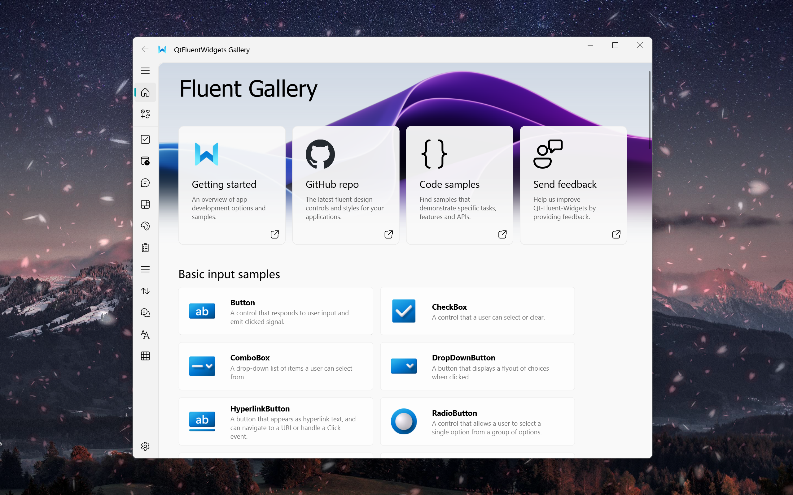

<p align="center">
  
</p>
  <h1 align="center">
  PySide6-Fluent-Widgets-Pro
</h1>
<p align="center">
  基于 <a href="https://github.com/zhiyiYo/PyQt-Fluent-Widgets">PyQt-Fluent-Widgets</a> 的 Fluent Design 风格组件库
</p>

<div align="center">

[](https://github.com/Fairy-Oracle-Sanctuary/Qt-Fluent-Widgets)
[](LICENSE)
[]()
[](https://www.qt.io)

</div>

<p align="center">
<a href="README.md">English</a> | 简体中文
</p>

<p align="center">
  
</p>

## 项目简介

本项目希望提供一套对开发者更友好的 PySide6 Fluent Design Widgets 组件库：

- 以免费版为基础
- 尽可能还原 Pro 版常用组件/交互
- 保持 API 易用、可读、易维护


## 当前状态

- **[范围]** 部分还原（持续更新）
- **[目标]** 优先还原高频使用的 Pro 组件
- **[兼容性]** Python 3.9+ / Windows、macOS、Linux


## 已还原组件（37）

已还原或扩展的组件（列表将持续更新）：

`HyperlinkToolButton` `FilledPushButton` `FilledToolButton`
`TextPushButton` `TextToolButton` `LuminaPushButton`
`OutlinedPushButton` `OutlinedToolButton` `RoundPushButton`
`RoundToolButton` `Chip` `Tag` `SubtitleCheckBox`
`SubtitleRadioButton` `ToolTipSlider` `RangeSlider`
`Pager` `FilledProgressBar` `MultiSegmentProgressRing`
`RadialGauge` `DropMultiFilesWidget` `DropSingleFileWidget`
`TopFluentWindow` `ChartWidget` `Splitter` `PinBox`
`LabelLineEdit` `StepProgressBar` `RoundTableWidget`
`RoundTableView` `LineTableWidget` `LineTableView`
`DropSingleFolderWidget` `DropMultiFoldersWidget`
`MultiSelectComboBox` `RoundListWidget` `RoundListView`

## 使用方式

本仓库更适合作为源码依赖使用。

### 方式 1：克隆并运行示例

```bash
git clone https://github.com/<your-name>/PySide6-Fluent-Widgets-Extend.git
python main.py
```

### 方式 2：集成到你的项目

将 `qfluentwidgets_pro` 目录复制到你的工程中（或将本仓库加入 Python Path），然后：

```python
from qfluentwidgets_pro import FluentWidget
```

依赖：

- PySide6（Qt for Python）


## 快速开始

```python
from PySide6.QtWidgets import QApplication, QVBoxLayout
from qfluentwidgets_pro import FluentWidget, FluentIcon, ToolTipSlider, RangeSlider, HyperlinkToolButton


class Window(FluentWidget):
    def __init__(self):
        super().__init__()
        layout = QVBoxLayout(self)

        layout.addWidget(ToolTipSlider())

        rs = RangeSlider()
        rs.setRange(0, 100)
        rs.setValues(20, 80)
        layout.addWidget(rs)

        layout.addWidget(HyperlinkToolButton(FluentIcon.LINK, "https://github.com"))


app = QApplication([])
w = Window()
w.show()
app.exec()
```


## 目录结构

- `qfluentwidgets_pro/`
  - 主包（免费版基础 + 已还原组件）
- `main.py`
  - 示例 / 调试入口
- `docs/`
  - 文档资源


## 免责声明

- 本项目为**社区驱动**的还原/扩展项目
- 与官方 QFluentWidgets Pro **无任何隶属关系**
- 请遵守原项目的开源协议与商业条款

## 🙏 致谢

- `Pager` `DropMultiFilesWidget` `DropSingleFileWidget` `Splitter` `PinBox` `LabelLineEdit` 组件实现参考了 [PySide6-Fluent-UI](https://github.com/HiyorinI/PySide6-Fluent-UI) (作者 HiyorinI)


## 计划（Roadmap）

- 统一组件 API 与文档
- 持续还原更多 Pro 组件（按社区需求优先级）
- 补充更多示例与截图