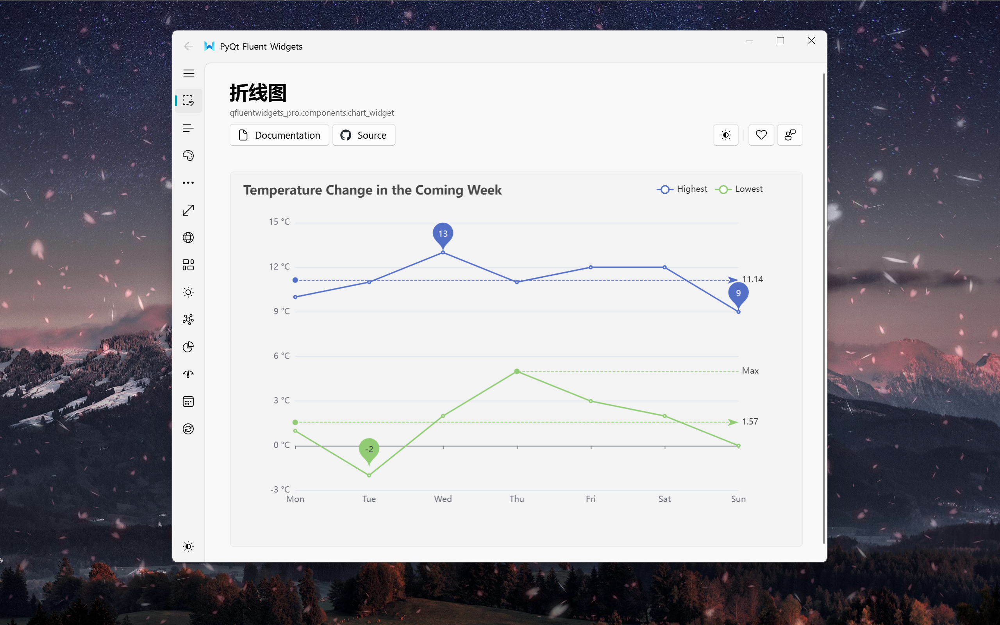

<p align="center">
  
</p>
  <h1 align="center">
  PySide6-Fluent-Widgets-Pro
</h1>
<p align="center">
  基于 <a href="https://github.com/zhiyiYo/PyQt-Fluent-Widgets">PyQt-Fluent-Widgets</a> 的 Fluent Design 风格组件库
</p>

<div align="center">

[](https://github.com/Fairy-Oracle-Sanctuary/Qt-Fluent-Widgets)
[](LICENSE)
[]()
[](https://www.qt.io)

</div>

<p align="center">
<a href="README.md">English</a> | 简体中文
</p>

<p align="center">
  
</p>

## 项目简介

本项目希望提供一套对开发者更友好的 PySide6 Fluent Design Widgets 组件库：

- 以免费版为基础
- 尽可能还原 Pro 版常用组件/交互
- 保持 API 易用、可读、易维护


## 当前状态

- **[范围]** 部分还原（持续更新）
- **[目标]** 优先还原高频使用的 Pro 组件
- **[兼容性]** Python 3.9+ / Windows、macOS、Linux


## 已还原组件

已还原或扩展的组件共 71 个（列表将持续更新）：

`HyperlinkToolButton` `FilledPushButton` `FilledToolButton`
`TextPushButton` `TextToolButton` `LuminaPushButton`
`IndeterminateProgressPushButton`
`ProgressPushButton`
`TimeLineWidget`
`FlyoutDialog`
`RangeCalendarPicker` `FastRangeCalendarPicker`
`CalendarTimePicker` `FastCalendarTimePicker`
`ImageMagnifierWidget`
`ImageComparisonSlider`
`ImageCropper`
`AvatarPicker`
`CodeEdit`
`ProgressInfoBar`
`ProgressToast`
`RoundProgressToast`
`RatingWidget`
`InteractiveRatingWidget`
`OutlinedPushButton` `OutlinedToolButton` `RoundPushButton`
`RoundToolButton` `Chip` `Tag` `SubtitleCheckBox`
`SubtitleRadioButton` `ToolTipSlider` `RangeSlider`
`Pager` `FilledProgressBar` `MultiSegmentProgressRing`
`RadialGauge` `DropMultiFilesWidget` `DropSingleFileWidget`
`TopFluentWindow` `ChartWidget` `Splitter` `PinBox`
`FilledFluentWindow`
`LabelLineEdit` `StepProgressBar` `RoundTableWidget`
`RoundTableView` `LineTableWidget` `LineTableView`
`DropSingleFolderWidget` `DropMultiFoldersWidget`
`MultiSelectionComboBox` `RoundListWidget` `RoundListView`
`TransparentRoundListWidget` `TransparentRoundListView`
`CategoryCardListWidget` `CategoryCardListView`
`Toast` `FontComboBox` `ExclusiveLiteFilter`
`OutlinedExclusiveLiteFilter` `MultiSelectionLiteFilter`
`OutlinedMultiSelectionLiteFilter` `WaterfallLayout`
`TopNavigationBar` `DropAnyWidget`
`TreeComboBox` `MultiSelectionTreeComboBox`

## 使用方式

本仓库更适合作为源码依赖使用。

### 方式 1：克隆并运行示例

```bash
git clone https://github.com/<your-name>/PySide6-Fluent-Widgets-Extend.git
python main.py
```

### 方式 2：集成到你的项目

将 `qfluentwidgets_pro` 目录复制到你的工程中（或将本仓库加入 Python Path），然后：

```python
from qfluentwidgets_pro import FluentWidget
```

依赖：

- PySide6（Qt for Python）


## 快速开始

```python
from PySide6.QtWidgets import QApplication, QVBoxLayout
from qfluentwidgets_pro import (
    FluentWidget,
    FluentIcon,
    ToolTipSlider,
    RangeSlider,
    HyperlinkToolButton,
    IndeterminateProgressPushButton,
)


class Window(FluentWidget):
    def __init__(self):
        super().__init__()
        layout = QVBoxLayout(self)

        layout.addWidget(ToolTipSlider())

        rs = RangeSlider()
        rs.setRange(0, 100)
        rs.setValues(20, 80)
        layout.addWidget(rs)

        layout.addWidget(HyperlinkToolButton(FluentIcon.LINK, "https://github.com"))

        self.progressButton = IndeterminateProgressPushButton("下载中...", self)
        layout.addWidget(self.progressButton)


app = QApplication([])
w = Window()
w.show()
app.exec()
```

`IndeterminateProgressPushButton` 会跟随当前主题和自定义主题色。
加载动画默认自动播放，可通过 `start()` / `stop()` 控制，使用 `isSpinning()` 查询状态。
点击按钮会正常发出 `clicked` 信号，不会切换动画状态。

`ProgressPushButton` 常态与主题色按钮一致，进度态显示居中的进度环和停止图标。
使用 `setProgressing(True)` 切换形态、`setValue(0..100)` 更新进度。
`setAutoProgressEnabled(True)` 开启点击进入进度态（默认关闭）；进度态点击发出
`stopRequested`，由业务处理取消。达到 100 不会自动切换形态。Buttons 页面提供模拟下载。

`ImageComparisonSlider(before, after)` 通过可拖动竖线和半透明双向箭头手柄对比两张图片。
支持路径、QImage、QPixmap；`setImages()` 更换图片，`setValue(0..100)` 设置分割百分比，
`valueChanged` 通知变化。支持方向键及 Home/End，Magnifier 页面提供双图对比示例。

`Toast.success(title, content, parent=window)` 显示顶部绿色状态条、标题、正文和可选关闭按钮。
同时支持 `info`、`warning`、`error`；`duration=-1` 持续显示直到手动关闭。
`ToastPosition` 提供六种位置，不同窗口分别堆叠，主页 Success 按钮展示 Lesson 4 示例。

`ProgressInfoBar` 复用 InfoBar 的定位、堆叠、中性背景和关闭按钮，环的运动直接沿用
不确定进度环。默认持续显示，关闭通知不会自动取消业务任务。主页提供演示按钮。

```python
from qfluentwidgets_pro import ProgressInfoBar

bar = ProgressInfoBar.new("请勿离开", "正在发送邮件，请耐心等待...", parent=window)
bar.setContent("正在上传附件...")
bar.setRemainingTime("剩余 10 秒")  # 可选文本，由业务计算、格式化
bar.setValue(65)  # 切换为确定进度，范围 0..100
bar.setIndeterminate(True)  # 切回不确定进度环
bar.close()  # 任务结束后关闭
```

支持 `setTitle()`、`setCustomBarColor(light, dark)`；剩余时间传空字符串可移除。
位置使用 `InfoBarPosition`，`duration=-1` 持续显示；提供 `closedSignal` 和 `valueChanged`。

`ProgressToast` 以紧凑的单行通知显示状态图标、提示信息、关闭按钮和底部进度条，带阴影。
复用 Toast 的定位和堆叠；`info`、`warning`、`error` 默认进度为 0，`success` 为 100。
默认持续显示，进度达到 100 不会自动切换状态、文案或关闭通知。

```python
from qfluentwidgets_pro import ProgressToast, InfoBarIcon

toast = ProgressToast.warning("正在下载文件，请耐心等待...", value=77, parent=window)
toast.setStateColor(InfoBarIcon.WARNING, "#9D5D00", "#FCE100")
toast.setStateColor(InfoBarIcon.SUCCESS, "#0F7B0F", "#6CCB5F")
toast.setValue(100)
toast.setIcon(InfoBarIcon.SUCCESS)
toast.setContent("文件下载成功")
```

两种状态颜色都可自定义，状态图标与进度条同步使用配置颜色。
`setStateColor(状态, 浅色, 深色=None)` 分别配置状态；`setCustomBarColor(浅色, 深色=None)`
为没有单独配置的状态提供统一颜色。不传深色则两个主题使用同一颜色。
`setUseAni(False)` 可禁用数值过渡；支持 `ToastPosition`、`duration`、`isClosable`、
`closed` 和 `valueChanged`。关闭通知不会自动取消任务，主页提供模拟下载和完成状态示例。

`RoundProgressToast` 是胶囊形加载通知，显示不确定进度环和提示文字，不含关闭按钮或状态条。
环的运动复用 `IndeterminateProgressRing`，颜色跟随当前主题色，隐藏时暂停。
复用 Toast 的位置、堆叠和 `closed` 信号。

```python
from qfluentwidgets_pro import RoundProgressToast

toast = RoundProgressToast.new("加载中，请稍候", parent=window)
toast.setContent("正在处理...")
toast.close()  # 任务结束后关闭
```

默认 `duration=-1` 持续显示，传入非负毫秒数可自动关闭；主页演示显示五秒的加载通知。

`RatingWidget(4.5)` 显示数值和右侧橙色矢量星标，通过 `setValue(数值)` 更新评分，
`valueChanged(float)` 通知变化。只展示评分，不提供点击星星打分的交互，也不限制为五分制。
`setDecimals(0..6)` 控制显示精度（默认一位小数，省略末尾零），
`setStarColor(浅色, 深色=None)` 可自定义星标颜色。主页提供数值输入框测试评分变化。

`InteractiveRatingWidget(3)` 显示五颗橙色星星：悬停时填满前面的星星，并按鼠标精确 X
坐标裁切当前星星，不取整、不限制半星。点击确认评分，移出恢复已确认的评分。
`setValue(0..5)` 设置评分，`hovered(float)` 通知预览，`valueChanged(float)` 通知确认值变化，
`displayValue()` 返回当前展示的评分。`setReadOnly(True)` 禁止修改；方向键按 0.1 调整，
Home/End 设置为 0/5。复用 `setStarColor(浅色, 深色=None)`，主页提供悬停和点击演示。

`CodeEdit` 基于原生 QPlainTextEdit，支持行号、当前行底色、缩进和 20 种语言高亮。
使用前安装可选依赖（库的其他控件不需要此依赖）：

```bash
python -m pip install -r requirements-codeedit.txt
```

```python
from qfluentwidgets_pro.components.widgets.code_edit import CodeEdit, CodeLanguage

editor = CodeEdit(language=CodeLanguage.JSON)
editor.setPlainText('{"enabled": true}')
editor.setLanguage("python")  # 只切换高亮，不修改代码
editor.setIndentSize(4)
editor.setLineNumbersVisible(True)
```

内置 Python、C、C++、C#、Java、JavaScript、TypeScript、JSON、HTML、CSS、XML、
YAML、TOML、INI、Bash、PowerShell、SQL、Go、Rust、Markdown。
后台使用 Pygments 对全文进行词法分析，保留多行和内嵌语言语义；丢弃过期版本，
仅对格式变化的行分批应用 Qt 高亮。超过 100 万字符时保留编辑、停用高亮，
通过 `highlightingFailed` 通知限制或词法错误。首版不包含自动补全、折叠、诊断或文件保存。
CodeEdit 展示页支持语言选择、加载示例、只读/行号开关和主题切换。

`AvatarPicker` 继承 AvatarWidget，悬停显示暗色圆形遮罩和白色相机图标，
点击选图后复用 ImageCropper 的圆形裁剪；确认更新头像并发出 `imageChanged(QImage)`，
取消保留原头像。通过 `setRadius()` 调整大小，`cropImage(image)` 直接打开指定图片裁剪。
Magnifier 页面包含头像选择器示例。

`ImageCropper(image, parent)` 提供四角缩放、区域拖动、旋转和水平翻转。
确认时通过 `imageCropped` 返回 QImage，取消保留调用方原预览。
`setCropShape(CropShape.CIRCLE)` 启用圆形裁剪，`setCropPathFactory(factory)`
扩展自定义 QPainterPath 形状；工具栏形状按钮按官方展示保持禁用。
展示页通过“选择图像”打开裁剪并更新预览，不提供保存/导出按钮。

`ImageMagnifierWidget` 继承 ImageLabel，悬停时显示跟随鼠标的圆形放大镜，
带主题色边框和十字标记。通过 `setMagnification(2.0)` 调整倍率、`setRadius(50)`
调整镜片半径，`setMagnifierEnabled(False)` 关闭。支持原有图片/缩放接口，
聚焦后可用方向键移动镜片；Magnifier 展示页提供 2×、3×、4× 切换。

`RangeCalendarPicker` 复用 CalendarPicker 的滚动日历；`FastRangeCalendarPicker`
复用 FastCalendarPicker 的轻量分页日历，并支持 `setFlyoutAnimationType()`。
第一次点击起点，移动鼠标预览，第二次点击终点提交。起止日期显示主题色描边，
范围内铺设跨周行连接的中性底色。支持反向排序、同日及跨月/年范围；
Esc 或外部点击取消未完成选择，保留已提交的范围。`setResetEnabled(True)` 显示重置按钮。

```python
from PySide6.QtCore import QDate
from qfluentwidgets_pro import RangeCalendarPicker, FastRangeCalendarPicker

picker = FastRangeCalendarPicker()
picker.setDateRange(QDate(2024, 3, 13), QDate(2024, 3, 21))
picker.setDateFormat('yyyy-MM-dd')
picker.rangeChanged.connect(lambda start, end: print(start, end))
start, end = picker.dateRange()  # 也可读取只读属性 startDate / endDate
```

`reset()` 清空已有选择时发出两个无效 QDate；`setDate(date)` 设置同日范围。
Buttons 展示页同时提供普通版和 Fast 版示例，两者均为纯 Qt 组件并在主包导出。
默认允许选择所有星期。在打开日历前调用 `setDisabledWeekDays({6, 7})` 可禁用周末
（周一=1，周日=7）：禁用日期显示灰色删除线，不能作为端点，但可处于范围内部。
修改配置后，如果现有范围端点被禁用，会清空该范围。示例开启周末禁用，并默认隐藏重置按钮。

`CalendarTimePicker` 将现有滚动日历和 24 小时时间滚轮组合在一个弹层中；
`FastCalendarTimePicker` 改用 Fast 分页日历。底部共用确认/取消按钮，日期和时间
一起提交。点击日期或滚动时间只修改草稿；取消、Esc、点击外部均保留原值，
Enter 确认。两者均为轻量 Qt 组件，在主包导出。

```python
from PySide6.QtCore import QDate, QDateTime, QTime
from qfluentwidgets_pro import CalendarTimePicker, FastCalendarTimePicker

picker = FastCalendarTimePicker()
picker.setDateTime(QDateTime(QDate(2026, 2, 10), QTime(20, 0, 0)))
picker.setDateTimeFormat('yyyy-MM-dd HH:mm:ss')
picker.dateTimeChanged.connect(lambda value: print(value))
value = picker.dateTime  # QDateTime 副本；也可读写 date / time 属性
```

默认显示秒。`setSecondVisible(False)` 隐藏秒列并将默认格式切换为分钟，
此模式确认后秒为 0；自定义格式不会被覆盖。`setDate()` / `setTime()` 保留另一部分，
支持零点时间，并在编辑时保留原 QDateTime 的时区信息。
`setResetEnabled(True)` 显示日历重置按钮；`reset()` 清空选择并发出无效 QDateTime。
仅日期或时间发生变化时，才发出对应的 `dateChanged` / `timeChanged`。
两个版本均支持 `setFlyoutAnimationType()`，Buttons 展示页已加入示例。

`FilledPushButton` 和 `FilledToolButton` 的浅色常态填充采用 Fluent 语义色
（中性、成功、警告、错误）；Attention 跟随主题色。原有暗色配色和悬停/按下的
半透明黑白背景保持不变。

`FlyoutDialog` 提供自定义内容区域和底部确认/取消图标按钮。
底栏高度为 40 逻辑像素，悬停区域撑满各自半边，不显示按钮提示，分割线为 2px；
正文按实际弹窗宽度计算换行高度，避免多余留白。
通过 `addWidget()` 添加控件、`showAt(target, parent)` 弹出，连接 `accepted` / `rejected`
处理结果；点击外部关闭按取消处理。复用 Flyout 的定位、阴影和动画，关闭后自动删除。
Buttons 页面提供 Show dialog 示例。

`TimeLineWidget` 提供分组标题、状态图标、连接线和圆角条目卡片。
通过 `addGroup(title, InfoBarIcon.SUCCESS)` 创建分组，再调用 `group.addItem(text, icon)`
添加条目；支持富文本、自动换行、动态移除分组和条目。TimeLine 展示页包含已完成、今日安排和待办事项。

`FilledFluentWindow` 提供默认展开的侧边栏、主题色填充的选中项和搜索框。
沿用 `FluentWindow` 的 `addSubInterface()` / `switchTo()` 接口，
搜索框自动搜索已注册页面的导航名称，点击结果或使用方向键和回车跳转。
按 Esc 关闭结果列表，清空输入不会改变当前页面；页面增删会同步更新搜索结果。
运行 `main.py`，在主页点击“打开 FilledFluentWindow 窗口”，
即可体验页面切换、搜索，以及设置页中的主题和自定义主题色切换。


## 按需导入与 Nuitka 打包

部分组件刻意不在包的 `__init__.py` 中统一导出，**不是漏实现**。统一入口中的导入可能让
Nuitka 把未使用的可选依赖纳入编译图；只有业务使用相应功能时，才从具体模块导入。

| 可选功能 | 按需导入模块 | 相关依赖 |
| --- | --- | --- |
| `ChartWidget` | `qfluentwidgets_pro.components.widgets.chart_widget` | QtWebEngine、QtQuickWidgets 及相关 Qt 运行库 |
| `CodeEdit`、`CodeLanguage` | `qfluentwidgets_pro.components.widgets.code_edit` | Pygments 语言解析器 |
| Acrylic 组件 | `qfluentwidgets_pro.components.material` 或 `qfluentwidgets_pro.components.widgets.acrylic_label` | 可选 CPU 模糊：NumPy、SciPy、Pillow、colorthief |
| 多媒体播放组件 | `qfluentwidgets_pro.multimedia` | QtMultimedia / QtMultimediaWidgets |
| `FramelessWebEngineView` | `qfluentwidgets_pro.qframelesswindow.webengine` | QtWebEngineWidgets |

```python
from qfluentwidgets_pro import PushButton, RadialGauge  # 轻量组件正常导出

# 只导入业务实际使用的可选组件：
from qfluentwidgets_pro.components.widgets.code_edit import CodeEdit, CodeLanguage
from qfluentwidgets_pro.components.widgets.chart_widget import ChartWidget
```

构造函数内的延迟导入、`try/except ImportError` 只是运行时行为，不能保证 Nuitka 不打包依赖。
Standalone 模式默认跟随导入；`--nofollow-import-to` 可以排除模块，但运行时使用被排除的
功能可能报错，详见 [Nuitka 官方说明](https://nuitka.net/user-documentation/use-cases.html#standalone-program-distribution)。

**Acrylic 的间接依赖需特别注意：** 导航仍会间接导入 Acrylic 辅助类。因此在安装了可选
依赖的源码环境中，仅导入包根也可能加载 NumPy/SciPy/Pillow/colorthief。无需 CPU 模糊时，
除了排除 NumPy/SciPy，还应排除 `qfluentwidgets_pro.common.image_utils`，使用已有的无模糊
回退；导航仍可使用，只是不对图片做 CPU 模糊。这不会关闭 Windows 原生云母效果。

```text
--nofollow-import-to=qfluentwidgets_pro.common.image_utils
--nofollow-import-to=numpy
--nofollow-import-to=scipy
```

`deploy.py` 打包的是 `main.py` 的**完整 gallery**，其中显式导入了图表和 CodeEdit 展示页。
它为动态解析器发现而主动包含 Pygments，不是轻量业务程序的打包模板。业务程序应使用自己的
入口，避免引入 gallery；未使用 CodeEdit 时不要照搬 `--include-package=pygments`，使用时则
须包含所需的动态加载解析器。最终是否纳入 Qt 插件或原生库，需要检查 Nuitka 编译报告和
产物，不能仅凭根包没有导出就判断。`RadialGauge` 为纯 QtWidgets，已补回正常导出，属于
意外遗漏，不是重型组件。

## 目录结构

- `qfluentwidgets_pro/`
  - 主包（免费版基础 + 已还原组件）
- `main.py`
  - 示例 / 调试入口
- `docs/`
  - 文档资源


## 免责声明

- 本项目为**社区驱动**的还原/扩展项目
- 与官方 QFluentWidgets Pro **无任何隶属关系**
- 请遵守原项目的开源协议与商业条款

## 🙏 致谢

- `Pager` `DropMultiFilesWidget` `DropSingleFileWidget` `Splitter` `PinBox` `LabelLineEdit` `Toast` 组件实现参考了 [PySide6-Fluent-UI](https://github.com/HiyorinI/PySide6-Fluent-UI) (作者 HiyorinI)


## 计划（Roadmap）

- 统一组件 API 与文档
- 持续还原更多 Pro 组件（按社区需求优先级）
- 补充更多示例与截图
